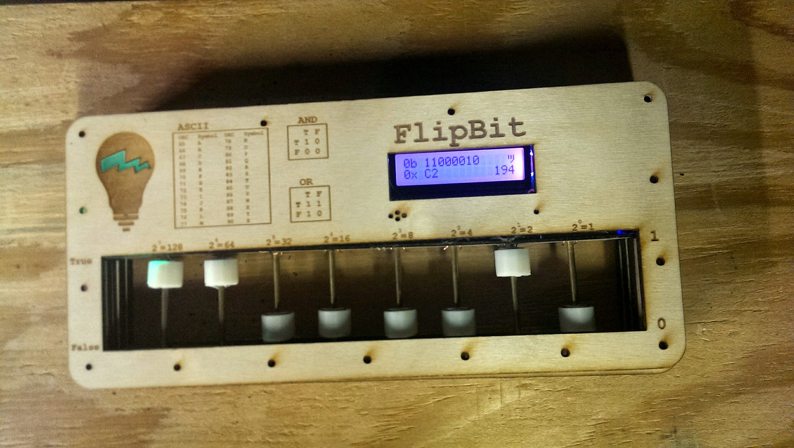

## FlipBit

https://dfirebaugh.github.io/flipbit

Ever hear the phrase "Computers are just ones and zeros"?

The FlipBit is an attempt to demistify, at a very fundemental level, how those ones turn into zeros and zeros to ones.

There’s a special moment for some people when they start looking at their computer as more than a youtube machine, where they realize a computer is a tool. Not just an email tool, or a wikipedia look up tool, but a wildly flexible, brilliant, mesmerizing tool that is plugged into almost every aspect of our life. And when those people have that moment, when their visions shifts just slightly, and they realize the power and wonderment, something is unleashed.

Coders are the wizards of tomorrow. And if I’m to believe what I’m told, tomorrow is here right now anyway. But in that future which isn’t quite now, everyone can be a coder. Every can make these machines do their bidding, be at the cool, bend to their playful or creative will.

This repo was inspired by a physical electronic project that I worked on with some friends several years ago. The FlipBit.

Read more [here](https://www.richmond.com/workitrichmond/news/meet-an-i-e-finalist-flipbit/article_dfa5fb0a-be9e-11e3-9ea4-001a4bcf6878.html)
